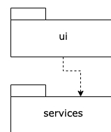

# Arkkitehtuurikuvaus

## Rakenne

Ohjelman rakenne noudattelee kolmitasoista kerrosarkkitehtuuria, ja koodin pakkausrakenne on seuraava:

Pakkaus _ui_ sisältää käyttöliittymästä, _services_ sovelluslogiikasta.
