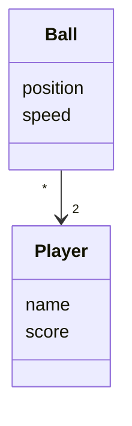
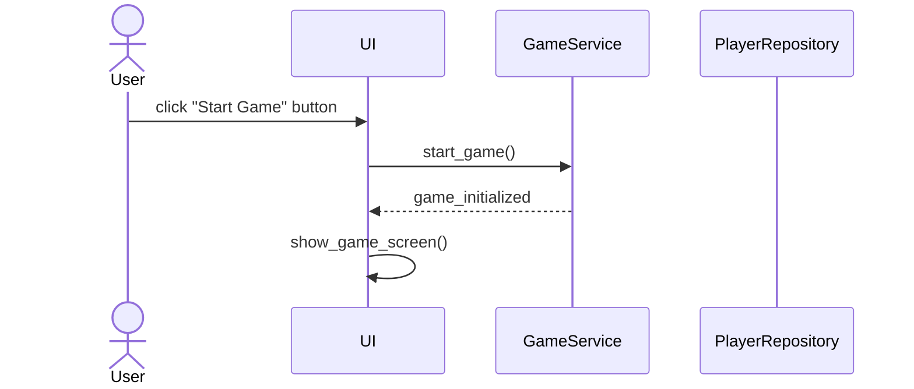
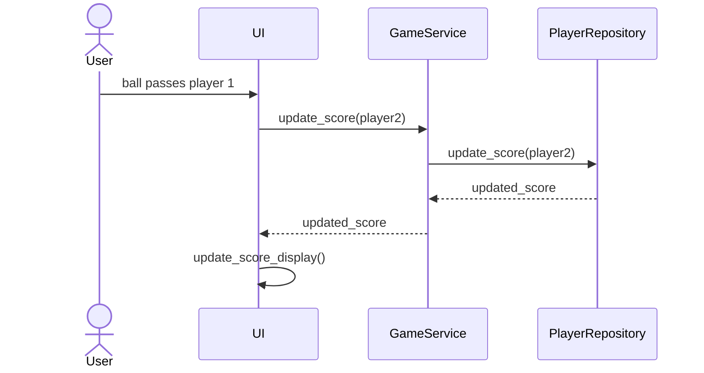
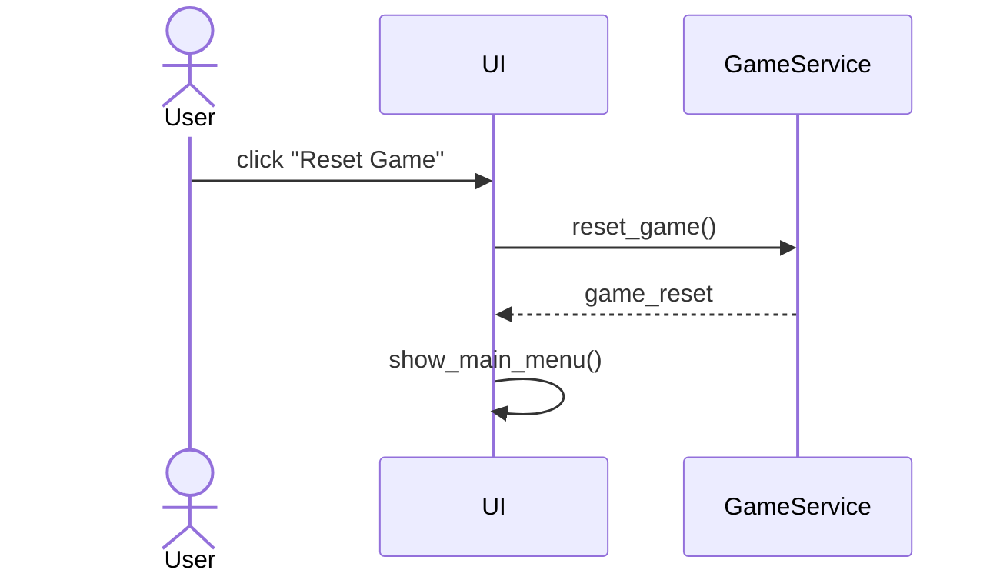

# Referemssi 

## Rakenne

Ohjelman rakenne noudattaa kolmitasoista kerrosarkkitehtuuria, ja koodin pakkausrakenne on seuraava:


Pakkaus `ui` sisältää käyttöliittymään liittyvän koodin, `services` vastaa pelilogiikasta, ja `repositories` huolehtii tietojen pysyväistallennuksesta. Pakkaus `entities` sisältää pelissä käytettävät olioiden luokat, kuten pelaajat.

## Käyttöliittymä

Käyttöliittymässä on kolme erillistä näkymää:

- Päävalikko
- Pelinäkymä
- Pelin päättymisnäkymä

Jokainen näkymä on toteutettu omana luokkanaan. Vain yksi näkymä on näkyvissä kerrallaan, ja näkymän vaihdosta huolehtii [UI](../src/ui/ui.py) -luokka. Käyttöliittymä on eristetty pelilogiikasta, ja se ainoastaan kutsuu pelilogiikan [GameService](../src/services/game_service.py) luokan metodeja.

Kun pelissä tapahtuu muutos, kuten uusi peli käynnistetään, pisteitä päivitetään tai peli loppuu, kutsutaan sovelluksen metodia [initialize_game_screen](https://github.com/adamygire/pong/...), joka renderöi pelinäkymän uudelleen ja näyttää päivitetyt tiedot, kuten pelitilanteen ja pisteet.

## Pelilogiikka

Pelin looginen tietomalli muodostuu luokista [Player](https://github.com/adamygire/pong) ja [Ball](https://github.com/adamygire/pong), jotka kuvaavat pelaajia ja palloa pelissä:



Pelin logiikka on toteutettu luokassa [GameService](https://github.com/adamygire/pong), joka tarjoaa metodit pelitoimintojen käsittelemiseksi. Näihin metodeihin kuuluvat esimerkiksi:

- `start_game()`
- `move_paddle()`
- `update_score(player_id)`
- `end_game()`

### Pakkaus/luokkakaavio

Seuraava kaavio havainnollistaa `GameService`-luokan ja muiden ohjelman osien välistä suhdetta:


## Tietojen pysyväistallennus

`repositories`-paketin luokat `ScoreRepository` ja `PlayerRepository` huolehtivat tietojen tallentamisesta. `ScoreRepository` tallentaa pelin pisteet tiedostoon, kun taas `PlayerRepository` tallentaa pelaajatiedot SQLite-tietokantaan.

Nämä luokat seuraavat [Repository](https://en.wikipedia.org/wiki/Data_access_object)-suunnittelumallia ja ne voidaan tarvittaessa korvata uusilla toteutuksilla, jos tietojen tallennustapa muuttuu. Testauksessa käytetään usein keskusmuistiin tallentavia toteutuksia tiedosto- ja tietokantaversioiden sijaan.

### Tiedostot

Peli tallentaa pelaajien ja pisteiden tiedot erillisiin tiedostoihin. Juuri ohjelman hakemistossa sijaitseva `.env`-konfiguraatiotiedosto määrittelee käytettävät tiedostonimet.

Pisteet tallennetaan CSV-tiedostoon seuraavassa formaatissa:

```
pelaaja1;100;pelaaja2;150
```

Jokainen rivi edustaa yhtä peliä, jossa on pelaajien nimet ja heidän pisteensä. Kentät erotetaan puolipisteellä.

Pelaajatiedot tallennetaan SQLite-tietokannan `players`-tauluun, joka alustetaan [initialize_database.py](https://github.com/adamygire/pong) tiedostossa.

## Päätoiminnallisuudet

Seuraavaksi kuvataan pelin päätoiminnallisuuksia sekvenssikaavioiden avulla.

### Uuden pelin aloittaminen

Kun käyttäjä klikkaa "Aloita peli" -painiketta päävalikossa, tapahtuu seuraava:



Tapahtumankäsittelijä [GameStartHandler](https://github.com/adamygire/pong) kutsuu pelilogiikan `start_game`-metodia. Tämä metodi alustaa pelin ja vie käyttöliittymän pelinäkymään, jossa peli alkaa.

### Pisteiden päivittäminen

Kun pallo menee toisen pelaajan mailan ohi, peli päivittää pisteet. Tällöin tapahtuu seuraavaa:



Pelinäkymän tapahtumakäsittelijä kutsuu pelilogiikan `update_score`-metodia, joka päivittää pelaajan pisteet ja näyttää ne käyttöliittymässä.

### Pelin nollaaminen

Jos käyttäjä päättää nollata pelin, tapahtuu seuraavasti:



Tapahtumankäsittelijä kutsuu `reset_game`-metodia, joka nollaa pelin tilan ja vie käyttäjän takaisin päävalikkoon.

### Muut toiminnot


